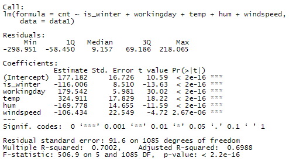

# Contributions

- **Kiarash Kianidehkordi**:  data description, compiling the dataset used in this paper, preliminary analysis code
- **Min Ji Koo**:  introduction, data description
- **Joyce Lin**:  introduction, preliminary analysis interpretation, knitting and finalizing the proposal

---

# Introduction

Motor transportation accounts for a staggering 20% of greenhouse gas emissions in the U.S. (Agency, 2005; Gotschi & Mills, 2008), pushing the need for sustainable solutions like bike-sharing systems to the forefront. These solutions are widely recognized as sustainable strategies to reduce CO2 emissions, alleviate traffic congestion, and preventing obesity and diabetes (Bajracharya et al., 2018; Cai et al., 2019; Lumsdon & Tolley, 2001; Zhang et al., 2015; Shaheen et al., 2013).

While bike-sharing contributes significantly to environmental and health benefits, it must also adapt to the unique demand patterns of the specific city that they are installed in. Thus, environmental and logistical factors are common metrics that researchers look at to determine the optimal allocation of bikes.  The effects of these metrics on bikeshare usage is well documented in literature.

Fournier, Christofa, and Knodler (2017) built a sinusodial model in their paper to examine seasonal bikeshare demand, and found a strong correlation between climate conditions, workday influences and bike-sharing usage.

Godavarthy & Taleqani (2017) in particular noted that many bike-sharing programs such as Great Rides, Capital Bikeshare, and Boulder B-cycle, temporarily suspended operations during winter due to significantly lower trip generation.

Beigi et al. (2022) examined the reallocation strategies used by Capital Bikeshare in Washington DC and found that the location of density of bikeshare stations significantly influenced bikeshare usage.  While location data is not considered in our paper, the allocation of bikeshare stations is still an important factor to keep in mind regarding the success of a bikeshare program.

Our analysis focuses on Capital Bikeshare (or just Bikeshare) in 2011 during peak hours (5-6 PM and 8 AM), seeking to determine **whether reducing operations to reflect seasonal demand changes is reasonable for Bikeshare, as supported by the broader evidence on climate impacts and bikeshare usage.**

Note that while this dataset has time series elements, the research question asks for the effect of *winter specifically* on Bikeshare usage.  Thus, we believe a linear regression is still appropriate with this research question.

---

# Data Description

The bike-sharing dataset, extracted from the UCI Machine Learning Repository (Fanaee-T & Gama, 2013), contains two years' worth of data from the Capital Bikeshare (CBS) system.

To avoid trend issues, the authors of the original paper (Fanaee-T, H., Gama, J, 2013) selected data corresponding only to the years 2011 and 2012, consisting of 3,807,587 records. After collecting the raw trip data, the authors aggregated it at two levels: hourly and daily. The hourly time series contains 17,379 hours, and the daily time series contains 731 days (Fanaee-T, H., Gama, J, 2013). Both time series were split into two sets: 2011 (train) and 2012 (test).

Weather temperature, apparent temperature, wind speed, wind gust, humidity, pressure, dew point, and visibility for each hour from January 1, 2011, to December 31, 2012, for Washington, D.C., USA, were extracted from (Freemeteo 2013) and mapped to the corresponding hours in the bike rental time series.

For hours with missing weather reports, the closest available report was used. Additionally, the official holidays of Washington, D.C., were extracted and mapped to the corresponding dates from (Department of Human Resources 2013). Holidays were combined with weekends, and each day was classified as either a working day or a non-working day. Based on the weather data, each hour was assigned one of four weather grades: good, cloudy, bad, or very bad (Fanaee-T, H., Gama, J,2013).

In the hourly scale, each record includes variables such as hour, month, working day status, season, weather grade, temperature, felt temperature, humidity, and wind speed, along with the hourly aggregated count of rented bikes as the target value. In the daily scale, each record contains variables such as month, working day status, season, daily average weather grade, daily average temperature, daily average felt temperature, daily average humidity, and daily average wind speed.

---

# Preliminary Results

**Data Source**: Bikeshare data from Washington DC, covering 2011-2012.

- **Variables used in this analysis**:
  - `season`: season (1: winter, 2: spring, 3: summer, 4: fall)
    - `is_winter`: variable created from season (1: winter, 0 otherwise)
  - `workingday`: weekday that is not a holiday (1, 0 otherwise)
  - `temp`: normalized temperature (°C), calculated by (t - t_min) / (t_max - t_min)
  - `hum`: normalized humidity. The values are divided to 100 (max)
  - `windspeed`: Normalized wind speed. The values are divided to 67 (max)
  - `cnt`: count of total rental bikes including both casual and registered (per hour)

- **Other variables**
  - `dteday`: date variable (YYYY-MM-DD)
  - `hr`: hour of the day (0-23)
  - `mnth`: month variable (1-12)
  - `yr`: year (0: 2011, 1: 2012)
  - `weathersit`: discrete variable denoting the weather conditions during a given hour
    - 1 : clear, few cloud, partly cloudy
    - 2: mist, cloudy mist, broken cloud, mist + few clouds
    - 3: light snow, light rain thunderstorm, scattered clouds, light rain + scatter clouds
    - 4: heavy rains, ice pellets + thunderstorm + mist, snow + fog
  - `atemp`: Normalized feeling temperature in Celsius

This analysis will take data from 2011 and for the hours 5 - 6PM and 8AM.  We take from 2011 only because 2011 data is intended to be training data, while  5 - 6PM and 8AM are shown to be the top 3 busiest hours for Bikeshare usage.  Focusing on peak hours in the morning and the afternoon captures the most critical hours for bike share demand and removes temporal continuity that would be present if all hours of the day were considered instead, which would have made this analysis invalid for a linear regression.

Once again, I will note that while this dataset has time series elements, the research question asks for the effect of *winter specifically* on Bikeshare usage.  Thus, I believe a linear regression is still appropriate with this research question, as the analysis will be focusing on the effect of winter = 1 versus winter = 0.  Of course, these choices hinge on the assumption that the variation of Bikeshare usage during the top 3 hours, holding other variables like temp and workingday constant, is independent.

The dataset that includes data from 2011 and for the hours 5 - 6PM and 8AM has 1,095 observations.

```{r setup, include=FALSE, warning=FALSE}

# Set global chunk options
knitr::opts_chunk$set(echo = FALSE, results = 'hide', message = FALSE, warning = FALSE)

# Load data
data <- read.csv("hour.csv")
data$dteday <- as.Date(data$dteday)

# Group the data by hour and calculate the average 'cnt' (bike usage)
avg_usage_by_hour <- aggregate(cnt ~ hr, data = data, FUN = mean)

# Sort by average usage in descending order and select the top 3 hours with the highest average usage
avg_usage_by_hour <- avg_usage_by_hour[order(-avg_usage_by_hour$cnt),]
top_3_hours <- head(avg_usage_by_hour, 3)
print(top_3_hours)
```
```{r}
# Subset data to only include what I want
data1 <- data[data$yr == 0 & data$hr %in% c(8, 17, 18), ]

# Select only the specified columns and create is_winter variable
data1 <- data1[, c("season", "workingday", "temp", "hum", "windspeed", "cnt")]

data1$is_winter <- ifelse(data1$season == 1, 1, 0)

write.csv(data1, file = "hour_modified.csv", row.names = FALSE)
summary(data1)
```

### Model Specification

The model is established as follows:

$$
\begin{equation}
\begin{split}

\hat{\text{cnt}}=&\hat\beta_0 + \hat\beta_1\text{is_winter} + \hat\beta_2\text{workingday}\\
&+\hat\beta_3\text{temp} + \hat\beta_4\text{hum} + \hat\beta_5\text{windspeed}\\
&+\epsilon

\end{split}
\end{equation}
$$

where hourly Bikeshare usage (`cnt`) is a function of a dummy for winter months, a dummy for a working day, normalized temperature, humidity, and wind speed.

```{r}
lin_reg = lm(cnt ~ is_winter + workingday + temp + hum + windspeed,
                  data = data1)
summary(lin_reg)
```



According to the regression analysis, Bikeshare usage during peak hours in 2011 drops by an average of 116 uses per hour during winter months.  Unsurprisingly, a working day is expected to increase hourly usage by 179.

While humidity has a higher magnitude coefficient, its range is [0, 1], such that 1 percentage point would decrease Bikeshare usage by only 2 per hour.  Similarly, temperature ranges between [0, 1] so that an increase of 1 percentage point from $t_{min}$ toward $t_{max}$ is predicted to increase Bikeshare traffic by 3.2.


### Residual Analysis

For the residuals of a linear regression, four assumptions should hold for the model to provide accurate predictions of the dataset:
1. linearity assumption
2. constant variance of the errors
3. normal errors
4. independent errors

While the fourth assumption is hard to test from just the data alone, the other three can be tested using various diagnostics.

```{r}
lin_reg_fitteds = fitted(lin_reg)
lin_reg_residuals = resid(lin_reg)

plot(lin_reg_fitteds, lin_reg_residuals,
     main = "Bikeshare Usage:  Fitted vs. Residual Values",
     xlab = "Fitted",
     ylab = "Residuals",
     col = "steelblue",
     cex = 0.6)
```

The scatterplot of residuals versus fitted values shows evidence of heteroscedasticity, as the variation in residuals increases significantly as the fitted values increase.  The variation in residuals increases drastically as the fitted value increases from 0 to 600, from around 100 to anywhere between -300 to 150.  This pattern indicates a violation of constant variance.

Moreover, the downward trend in the residuals as the fitted values increases suggests a violation of the linearity assumption.  If the linearity assumption held, the residuals would be randomly distributed around 0 with no discernible pattern.  The fact that the scatter exhibits a pattern may mean that the model is not capturing the relationship between the predictors and the response accurately.

```{r}
# Create a QQ plot for the residuals
par(mfrow=c(1, 2))

hist(rstandard(lin_reg),
     main = "Standardized residuals histogram",
     xlab = "standardized residuals")

qqnorm(lin_reg_residuals,
       main = "QQ Plot of Residuals",
       xlab = "Theoretical Quantiles",
       ylab = "Sample Quantiles",
       col = "steelblue",
       cex = 0.6)

# Add a reference line to the QQ plot
qqline(lin_reg_residuals, col = "red")
```

The QQplot above shows that the residuals deviate from the red line at both tails, suggesting that it does not follow a normal distribution.  Additionally, the histogram shows a negative skew.  This deviation in the tails implies that the model struggles with extreme residuals, potentially pointing to non-normality in the tails of the distribution.

```{r}
plot(data1[, c(7, 2, 3, 4, 5)], col = 'steelblue', cex = 0.6)
```

With the exception of dummy variables `is_winter` and `workingday`, for which the relationship can be hard to tell, the other variables appear to have unusual scatter patterns for the most part.  Most notably, in the relationship between `temp` or `hum` and `windspeed`, there exists a row of data points along the edge of the graph that is separate from the rest of the scattered data.  This separation may disproportionately affect the model.

---
---

# Bibliography

- Agency, E. E. (2005). The European environment: State and outlook 2005. Office for Official Publ. of the European Communities.
- Beigi, P., Khoueiry, M., Rajabi, M. S., & Hamdar, S. (2022). Station reallocation and rebalancing strategy for bike-sharing systems: A case study of Washington DC. arXiv. https://arxiv.org/abs/2204.07875
- Department of Human Resources: District of Columbia. Washington D.C. holiday schedule. http://dchr.dc.gov/page/holiday-schedule (2013)
- Fanaee-T, H. (2013). Bike Sharing [Dataset]. UCI Machine Learning Repository. https://doi.org/10.24432/C5W894.
- Fanaee-T, H., Gama, J. Event labeling combining ensemble detectors and background knowledge. Prog Artif Intell 2, 113–127 (2014). https://doi.org/10.1007/s13748-013-0040-3
- Freemeteo: Washington D.C. weather history. http://www.freemeteo.com (2013)
- Fournier, N., Christofa, E., & Knodler, M. A., Jr. (2017). A sinusoidal model for seasonal bicycle demand estimation. Transportation Research Part D, Transport and Environment, 50, 154–169.
- Godavarthy, R. P., & Taleqani, A. R. (2017). Winter bikesharing in US: User willingness,and operator’s challenges and best practices. Sustainable Cities and Society, 30, 254–262.
- Gotschi, T., & Mills, K. (2008). Active transportation for America: The case for increased federal investment in bicycling and walking.
- Shaheen, S.A., Cohen, A.P., Martin, E.W.: Public Bikesharing in North America. Transportation Research Record: Journal of the Transportation Research Board, No. 2387, Transportation Research Board of the National Academics, Washington, D.C., pp. 83–92 (2013)
- Wadud, Z. (2014). Cycling in a changed climate. Journal of Transport Geography, 35,12–20.

