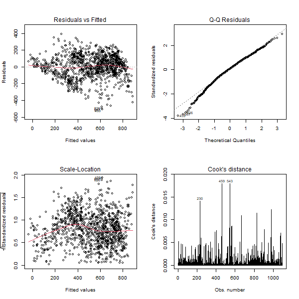

# Contributions

- **Kiarash Kianidehkordi**:  introduction, data description, compiling the dataset used in this paper, preliminary analysis code
- **Min Ji Koo**:  introduction, data description
- **Joyce Lin**:  introduction, preliminary analysis interpretation, knitting and finalizing the proposal

---

# Introduction

Motor transportation accounts for a staggering 20% of greenhouse gas emissions in the U.S. (Agency, 2005; Gotschi & Mills, 2008), pushing the need for sustainable solutions like bike-sharing systems to the forefront. These solutions are widely recognized as sustainable strategies to reduce CO2 emissions, alleviate traffic congestion, and preventing obesity and diabetes (Bajracharya et al., 2018; Cai et al., 2019; Lumsdon & Tolley, 2001; Zhang et al., 2015; Shaheen et al., 2013).

While bike-sharing contributes significantly to environmental and health benefits, it must also adapt to the unique demand patterns of the specific city that they are installed in. Thus, environmental and logistical factors are common metrics that researchers look at to determine the optimal allocation of bikes.  The effects of these metrics on bikeshare usage is well documented in literature.

Fournier, Christofa, and Knodler (2017) built a sinusodial model in their paper to examine seasonal bikeshare demand, and found a strong correlation between climate conditions, workday influences and bike-sharing usage.

Godavarthy & Taleqani (2017) in particular noted that many bike-sharing programs such as Great Rides, Capital Bikeshare, and Boulder B-cycle, temporarily suspended operations during winter due to significantly lower trip generation.

Beigi et al. (2022) examined the reallocation strategies used by Capital Bikeshare in Washington DC and found that the location of density of bikeshare stations significantly influenced bikeshare usage.  While location data is not considered in our paper, the allocation of bikeshare stations is still an important factor to keep in mind regarding the success of a bikeshare program.

Our analysis focuses on Capital Bikeshare (or just Bikeshare) in 2011 during peak hours (5-6 PM and 8 AM), seeking to determine **whether reducing operations to reflect seasonal demand changes is reasonable for Bikeshare, as supported by the broader evidence on climate impacts and bikeshare usage.**  To do this, we assess the difference in peak hour usage between winter-time and non-winter time, controlling for weather and weekend/holiday factors.

Note that while this dataset has time series elements, the research question asks for the effect of *winter specifically* on Bikeshare usage.  Thus, we believe a linear regression is still appropriate with this research question.

---

# Methods

500 words max

We begin with the initial model:

$$
\hat{cnt} = \beta_0 + \beta_1 is\_winter + \beta_2 workingday + \beta_3 temp + \beta_4 hum + \beta_5 windspeed + \epsilon
$$

where hourly Bikeshare usage for peak hours (\(cnt\)) is a function of:

- \(is\_winter\): A dummy for winter months
- \(workingday\): A dummy for a working day
- \(temp\): Normalized temperature
- \(hum\): Humidity
- \(windspeed\): Wind speed.

Here is an overview of our method:

- assessing + transforming the model
   - assumptions of linear regression
   - outliers
   - multicollinearity in the predictors
- variable selection

## Assumptions of Linear Regression
The assumptions of linear regression are:

1) Linearity,
2) Constant variance of errors,
3) Normal distribution of errors,
4) Independence of errors.

The fourth assumption is hard to test from just the data alone and is typically assumed to hold, but the other three can be tested using the residual plots and a Q-Q plot.  If signs of non-linearity, heteroscedasticity, or non-normality are observed, appropriate transformations may be required to address these signs.  Typically, the transformation will be logarithmic or achieved using the boxcox method.

## Outliers

First, we assess the data for any potential outliers using Cook's Distance.  For any identified outliers, we evaluate their leverage and influence

Leverage is measured using hat values, with values exceeding $2(p+1)\over n$ indicating high leverage. Influence is measured through differences in individual betas (DFBETAs) and differences in individual fits (DFFITS), with thresholds of $2\over \sqrt{n}$ and $2\sqrt{(p+1)\over n}$, respectively.  Observations deemed both influential and high leverage will be removed;  otherwise they will be kept.

## Multicollinearity in the Predictors

Following this, we assess the adequacy of the model.  We begin with a matrix plot of predictors and a correlation matrix to examine the relationships among the predictors and the response.  The goal is to identify any signs of multicollinearity, and identify non-linear relationships between the response and a predictor.

To quantify multicollinearity in particular, we calculate the variance inflation factor (VIF) for each predictor;  generally, a VIF that exceeds a threshold of 5 indicates problematic multicollinearity, which necessitates removing, adding, or combining predictors.

## Variable Selection

Once the model is assessed and transformed, the standardized residual histogram should follow a normal distribution, and the residual scatter plot should show no discernible pattern.

---

# Results

750 words max

We begin with the initial model:

$$
\hat{cnt} = \beta_0 + \beta_1 is\_winter + \beta_2 workingday + \beta_3 temp + \beta_4 hum + \beta_5 windspeed + \epsilon
$$

where hourly Bikeshare usage for peak hours (\(cnt\)) is a function of:
- \(is\_winter\): A dummy for winter months
- \(workingday\): A dummy for a working day
- \(temp\): Normalized temperature
- \(hum\): Humidity
- \(windspeed\): Wind speed.

<strong>Table 1:</strong> Residual diagnostic plots and Cook's Distance for initial model assessment.

The scatterplots of residuals versus fitted and scale-location show evidence of heteroscedasticity, that being the funnel shape that begins on the left and expands toward the right. This pattern indicates a violation of constant variance and linearity. Additionally, the QQplot above shows that the residuals deviate  at both tails, suggesting a violation of normality.

We also examined the possibility of outliers within the data.  However, the observations highlighted by Cook's Distance were not found to have high leverage or influence.

---

# Conclusion & Limitations

350 words max

---

# Appendix

---
---

# Bibliography

- Agency, E. E. (2005). The European environment: State and outlook 2005. Office for Official Publ. of the European Communities.
- Beigi, P., Khoueiry, M., Rajabi, M. S., & Hamdar, S. (2022). Station reallocation and rebalancing strategy for bike-sharing systems: A case study of Washington DC. arXiv. https://arxiv.org/abs/2204.07875
- Department of Human Resources: District of Columbia. Washington D.C. holiday schedule. http://dchr.dc.gov/page/holiday-schedule (2013)
- Fanaee-T, H. (2013). Bike Sharing [Dataset]. UCI Machine Learning Repository. https://doi.org/10.24432/C5W894.
- Fanaee-T, H., Gama, J. Event labeling combining ensemble detectors and background knowledge. Prog Artif Intell 2, 113–127 (2014). https://doi.org/10.1007/s13748-013-0040-3
- Freemeteo: Washington D.C. weather history. http://www.freemeteo.com (2013)
- Fournier, N., Christofa, E., & Knodler, M. A., Jr. (2017). A sinusoidal model for seasonal bicycle demand estimation. Transportation Research Part D, Transport and Environment, 50, 154–169.
- Godavarthy, R. P., & Taleqani, A. R. (2017). Winter bikesharing in US: User willingness,and operator’s challenges and best practices. Sustainable Cities and Society, 30, 254–262.
- Gotschi, T., & Mills, K. (2008). Active transportation for America: The case for increased federal investment in bicycling and walking.
- Shaheen, S.A., Cohen, A.P., Martin, E.W.: Public Bikesharing in North America. Transportation Research Record: Journal of the Transportation Research Board, No. 2387, Transportation Research Board of the National Academics, Washington, D.C., pp. 83–92 (2013)
- Wadud, Z. (2014). Cycling in a changed climate. Journal of Transport Geography, 35,12–20.

