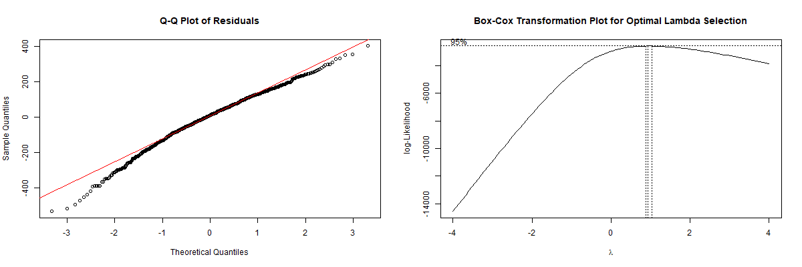
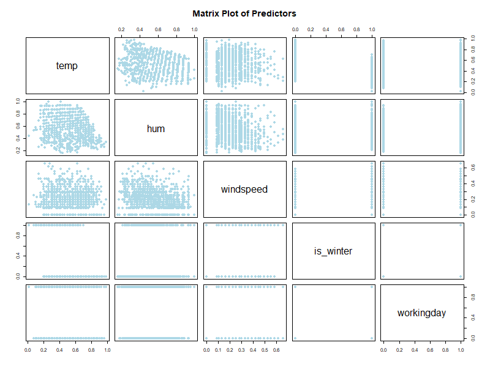
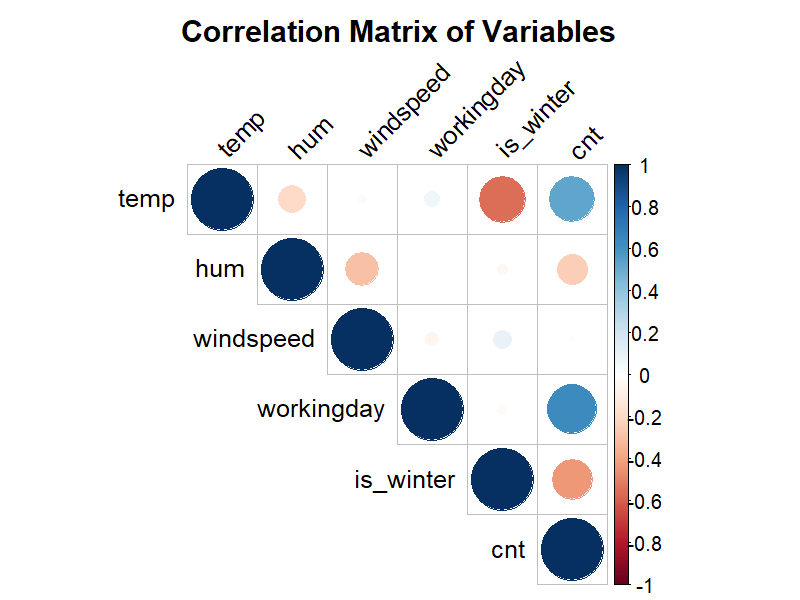
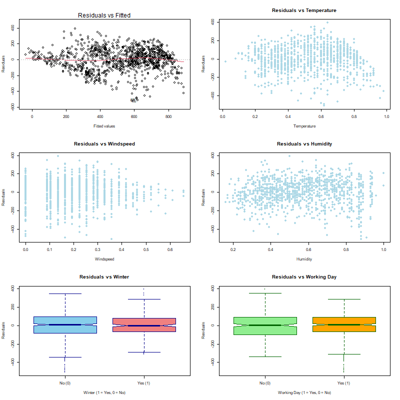

```{r setup, include=FALSE}
# Load libraries needed throughout the document
library(knitr)
library(car) # For VIF calculation
library(flextable) # Optional, for advanced table formatting
library(here)
library(readr)

```

# Contributions

- **Kiarash Kianidehkordi**:  introduction, analysis code, interpretation, limitations
- **Min Ji Koo**:  introduction, analysis code
- **Joyce Lin**:  introduction, methods, analysis code, conclusion, knitting and finalizing

---

# Introduction

Motor transportation accounts for a staggering 20% of greenhouse gas emissions in the U.S. (Agency, 2005; Gotschi & Mills, 2008), pushing the need for sustainable solutions like bike-sharing systems to the forefront. These solutions are widely recognized as sustainable strategies to reduce CO2 emissions, alleviate traffic congestion, and preventing obesity and diabetes (Bajracharya et al., 2018; Cai et al., 2019; Lumsdon & Tolley, 2001; Zhang et al., 2015; Shaheen et al., 2013).

While bike-sharing contributes significantly to environmental and health benefits, it must also adapt to the unique demand patterns of the specific city that they are installed in. Thus, environmental and logistical factors are common metrics that researchers look at to determine the optimal allocation of bikes.  The effects of these metrics on bikeshare usage is well documented in literature.

Fournier, Christofa, and Knodler (2017) built a sinusodial model in their paper to examine seasonal bikeshare demand, and found a strong correlation between climate conditions, workday influences and bike-sharing usage.

Godavarthy & Taleqani (2017) in particular noted that many bike-sharing programs such as Great Rides, Capital Bikeshare, and Boulder B-cycle, temporarily suspended operations during winter due to significantly lower trip generation.

Beigi et al. (2022) examined the reallocation strategies used by Capital Bikeshare in Washington DC and found that the location of density of bikeshare stations significantly influenced bikeshare usage.  While location data is not considered in our paper, the allocation of bikeshare stations is still an important factor to keep in mind regarding the success of a bikeshare program.

Our analysis focuses on Capital Bikeshare (or just Bikeshare) in 2011 during peak hours (5-6 PM and 8 AM), seeking to determine **whether reducing operations to reflect seasonal demand changes is reasonable for Bikeshare, as supported by the broader evidence on climate impacts and bikeshare usage.**  To do this, we assess the difference in peak hour usage between winter-time and non-winter time, controlling for weather and weekend/holiday factors.

Note that while this dataset has time series elements, the research question asks for the effect of *winter specifically* on Bikeshare usage.  Thus, we believe a linear regression is still appropriate with this research question.

---

# Methods

We begin with the initial model:

$$
\hat{cnt} = \beta_0 + \beta_1 is\_winter + \beta_2 workingday + \beta_3 temp + \beta_4 hum + \beta_5 windspeed + \epsilon
$$

where hourly Bikeshare usage for peak hours (\(cnt\)) is a function of:

- \(is\_winter\): A dummy for winter months
- \(workingday\): A dummy for a working day
- \(temp\): Normalized temperature between [0, 1]
- \(hum\): Humidity
- \(windspeed\): Wind speed

The assumptions of linear regression are:

1) Linearity
2) Constant variance of errors
3) Normal distribution of errors
4) Independence of errors

The fourth assumption is hard to test from just the data alone and is assumed to hold, but the other three can be tested using the residual plots and a Q-Q plot.  If signs of non-linearity, heteroscedasticity, or non-normality are observed, transformations are required to address these signs.

Before we transform the model, we assess the data for any potential outliers using Cook's Distance.  For any identified outliers, we evaluate their leverage and influence.  Leverage is measured using hat values, with values exceeding $2(p+1)\over n$ indicating high leverage. Influence is measured through differences in individual betas (DFBETAs) and differences in individual fits (DFFITS), with thresholds of $2\over \sqrt{n}$ and $2\sqrt{(p+1)\over n}$, respectively.  Observations deemed both influential and high leverage will be removed.

Following the outlier analysis, we use a matrix plot of predictors and a correlation matrix to identify signs of multicollinearity and non-linear relationships between the response and a predictor.  To quantify multicollinearity, we calculate the variance inflation factor (VIF) for each predictor;  generally, a VIF that exceeds a threshold of 5 necessitates removing, adding, or combining predictors.

Next, we inspect the residuals vs. fitted values plot for constant variance. A random scatter of residuals suggests constant variance, while a funnel shape or systematic pattern indicates heteroscedasticity. We apply log or power transformations to the individual variables that show heteroscedasticity.

Finally, we examine the normality of the residuals. A Q-Q plot of the residuals is used to assess whether they approximately follow a normal distribution. In cases of observed non-normality, we apply transformations to the response variable or predictors to improve normality.  Here, we try the Box-Cox method, where the optimal lambda is determined for the most ideal transformation.

Now, we analyze the significance of the model itself using an F-test.  If the F-test fails to reject the null hypothesis ($H_0: \beta_1 = \beta_2 = ... = 0$), that means none of the predictors contribute meaningfully, which would require restructuring the initial model.  However, if the F-test rejects the null hypothesis, we employ backward selection using the Bayesian Information Criterion (BIC) to determine the optimal subset of predictors.  BIC iteratively removing predictors from the full model based on their statistical significance.  BIC penalizes model complexity more heavily than other criteria like AIC, which helps balance the trade-off between an accurate model and overfitting.

Once BIC is complete, the final model can be interpreted.  By eliminating unnecessary predictors and ensuring that the assumptions for linear regression are met, the resulting model can provide a clearer and more reliable understanding of the relationship between predictors and the response variable.

---

# Results

Once again, the initial model is:

$$
\hat{cnt} = \beta_0 + \beta_1 is\_winter + \beta_2 workingday + \beta_3 temp + \beta_4 hum + \beta_5 windspeed + \epsilon
$$

```{r, include=FALSE, warning=FALSE}
totalData <-read_csv(here("data", "hour.csv"))

totalData$is_winter <- ifelse(totalData$season == 1, 1, 0)
totalData$season <- NULL
hourData <- totalData[totalData$hr %in% c(8, 17, 18) & totalData$yr == 1, ]
```

The initial $R^2$ is 0.7028, and the full F-statistic is 514.7, suggesting that the initial model is significant and explains 70% of the variation in peak hourly Bikeshare usage.

### Initial Diagnostics

Initial diagnostics included the residuals vs. fitted values plot, residuals vs. predictor scatter plots, a matrix plot of predictors, and their correlation matrix (see Appendix, Table A and B). These diagnostics were conducted prior to any transformations to assess the relationships among predictors and identify potential signs of multicollinearity or other violations of regression assumptions.

In addition to the initial diagnostics, we also screened the data for influential/high leverage outliers with Cook's Distance.  While some observations had elevated Cook’s Distance values, they did not exhibit high leverage or influence when evaluated using hat values, DFBETAs, and DFFITS. Therefore, no observations were removed from the dataset.

### Multicollinearity

The matrix plots and correlation matrix revealed some correlation between humidity and temperature, as well as between temperature and the winter season indicator. However, variance inflation factors (VIFs) for these pairs were computed and found to be below the threshold (VIF < 5), indicating weak multicollinearity. Therefore, no interaction terms were included in the final model.

```{r vif-table, echo=FALSE, message=FALSE}
# Hardcoded VIF values as a data frame
vif_table <- data.frame(
  Predictor = c("temp", "windspeed", "hum", "is_winter", "workingday"),
  VIF = c(1.55, 1.11, 1.17, 1.49, 1.01)
)

# Display the table using knitr::kable
kable(vif_table, 
      col.names = c("Predictor", "VIF"),
      caption = "**Table 1**:  Variance Inflation Factor (VIF) Values for Predictors")
```

### Addressing Linearity Assumptions

Following the multicollinearity analysis, we assessed the scatterplots of residuals vs. predictors (Appendix, Table C) to identify any non-linear relationships.  The plots revealed non-linearity for humidity, as evidenced by a clear quadratic pattern in the residuals vs. humidity plot, prompting the inclusion of a squared term ($hum^2$) to address this non-linearity.

We next examined the individual residual vs. predictor plots (Appendix, Table A).  The residual vs. wind speed plot revealed a funnel shape, indicating heteroscedasticity, which we addressed by applying a log-transformation to wind speed ($log(windspeed+1)$).

While we considered transforming temperature by adding a polynomial term due to the observed decreasing pattern in the residuals vs. temperature plot, this transformation did not result in noticeable improvement and instead exacerbated the heteroscedasticity. Therefore, temperature was retained in its original linear form.

<div style="text-align: center;">

<p><strong>Table 2:</strong> Residuals vs. Fitted Value Plot</p>
</div>

Finally, we analyzed the Q-Q plot of the residuals, which revealed deviations from normality at both tails. To confirm this observation, we applied the Box-Cox transformation method (Table 3) to identify the optimal transformation for the response variable. The analysis suggested an optimal lambda of $\lambda \approx 0.93$, which is very close to 1. Consequently, we decided not to transform the response variable.

<div style="text-align: center;">

<p><strong>Table 3:</strong> Q-Q Plot and Box-Cox Method (Log vs Sqrt)</p>
</div>

### Variable Selection

Having tested and addressed the key assumptions of linear regression, as outlined in the methodology, we proceeded to refine the model by selecting the most relevant predictors. Using backward selection guided by the Bayesian Information Criterion (BIC), the stepwise algorithm iteratively removed predictors with limited contribution to the model. This process ultimately excluded the log-transformed wind speed ($\log(windspeed+1)$) from the final model.

Thus, the model became:

$$
\hat{cnt} = \beta_0 + \beta_1 is\_winter + \beta_2 workingday + \beta_3 temp + \beta_4 hum^2 + \epsilon
$$

### Interpretation
```{r, echo=FALSE, message=FALSE}
transformedFitted <- lm (cnt ~ temp + (I(hum^2)) + is_winter + I(workingday == 1), data = hourData)

summary(transformedFitted)
```

The intercept of 204.5 represents the estimated hourly bike usage during peak hours when all predictors are at their reference levels (e.g., the normalized temperature is at its baseline, it is not winter, and it is not a working day).

Temperature initially appears to have a positive and substantial effect on bike usage, with a coefficient of 391.1. However, since temperature is normalized to a range of 0 to 1, the interpretation becomes more meaningful when considering changes in its normalized value. Specifically, a 0.1 increase in normalized temperature leads to an increase of approximately 39.1 bikes used per hour during peak hours.

The coefficient for hum^2 is more difficult to interpret directly, but considering that it, like temperature, falls between 0 and 1, the coefficient’s substantial value is somewhat diminished. A 0.1 unit increase in `hum^2` corresponds to a decrease of 21.2 bikes per hour during peak hours. Consequently, the actual impact on bike usage per unit change in humidity is smaller than the raw coefficient suggests.

As expected, the is_winter variable has a significant impact: peak hour bike usage decreases by 140 on average during the winter months compared to other seasons.

More influential than is_winter is the working_day variable, which shows the most substantial effect. It is associated with an estimated increase of 322.4 bikes used per hour during working days compared to non-working days.

The model as a whole is statistically significant, as indicated by the F-statistic of 623.1 and p < 0.05, and all individual predictors are statistically significant as well, based on their p-values. The model explains approximately 69.59% of the variance in the dependent variable ($R^2# = 0.6959) and remains robust after adjustment (#R_{adj}^2# = 0.6948).

---

# Conclusion & Limitations

The two most impactful variables in peak hourly bike usage, according to the model, are is_winter and working day.  For is_winter, this result highlights the significant impact that winter conditions have on bike usage. Factors like snow or ice blocking bike lanes likely discourage people from biking and encourage alternatives like driving or taking the subway.

The substantial increase in bike usage on working days emphasizes the role of cycling as a commuting option. Expanding bike-sharing programs, enhancing bike lane networks near business districts, and offering workplace incentives like secure bike parking or shower facilities could further support this commuting trend.

The model's validity is limited due to several factors. The model assumes that hourly bike usage is constant from day to day, holding all factors within the model constant.  However, it is possible that an increase in the number of operational bikes could occur over time, which would introduce a temporal variability that the model does not account for. Additionally, the data was collected from only one company in one city in one year (2011), meaning the conclusions cannot be generalized without further studies across different demographics and regions.

While a Box-Cox recommended practically no transformation ($\lambda = 0.93$), it remains that the residuals display a peculiar pattern, particularly that the left corner of the residuals appear to have been chopped off (see Appendix Table C).  Interaction terms, which might have logically better explained the relationships between predictors, were excluded from the model since the VIFs were below the threshold necessary to diagnose strong multicollinearities. Logical interactions may include:  temperature and is_winter, humidity and is_winter.  This exclusion might have compromised the ability to capture complex interactions, limiting the comprehensiveness of the model.

These issues collectively affect the regression assumptions necessary for the validity of statistical tests that were conducted after variable selection. As a result, while the model demonstrates reasonable predictive power based on $R^2$ & $R^2_{adj}$, these limitations suggest that caution is required when interpreting the results or applying the model to other datasets.

---

# Appendix

<div style="text-align: center;">

<p><strong>Table A:</strong> Matrix Plot of Predictors</p>
</div>

<div style="text-align: center;">

<p><strong>Table B:</strong> Correlation Matrix</p>
</div>

<div style="text-align: center;">

<p><strong>Table C:</strong> Residuals vs. Predictors Plots</p>
</div>


---
---

# Bibliography

- Agency, E. E. (2005). The European environment: State and outlook 2005. Office for Official Publ. of the European Communities.
- Beigi, P., Khoueiry, M., Rajabi, M. S., & Hamdar, S. (2022). Station reallocation and rebalancing strategy for bike-sharing systems: A case study of Washington DC. arXiv. https://arxiv.org/abs/2204.07875
- Department of Human Resources: District of Columbia. Washington D.C. holiday schedule. http://dchr.dc.gov/page/holiday-schedule (2013)
- Fanaee-T, H. (2013). Bike Sharing [Dataset]. UCI Machine Learning Repository. https://doi.org/10.24432/C5W894.
- Fanaee-T, H., Gama, J. Event labeling combining ensemble detectors and background knowledge. Prog Artif Intell 2, 113–127 (2014). https://doi.org/10.1007/s13748-013-0040-3
- Freemeteo: Washington D.C. weather history. http://www.freemeteo.com (2013)
- Fournier, N., Christofa, E., & Knodler, M. A., Jr. (2017). A sinusoidal model for seasonal bicycle demand estimation. Transportation Research Part D, Transport and Environment, 50, 154–169.
- Godavarthy, R. P., & Taleqani, A. R. (2017). Winter bikesharing in US: User willingness,and operator’s challenges and best practices. Sustainable Cities and Society, 30, 254–262.
- Gotschi, T., & Mills, K. (2008). Active transportation for America: The case for increased federal investment in bicycling and walking.
- Shaheen, S.A., Cohen, A.P., Martin, E.W.: Public Bikesharing in North America. Transportation Research Record: Journal of the Transportation Research Board, No. 2387, Transportation Research Board of the National Academics, Washington, D.C., pp. 83–92 (2013)
- Wadud, Z. (2014). Cycling in a changed climate. Journal of Transport Geography, 35,12–20.

